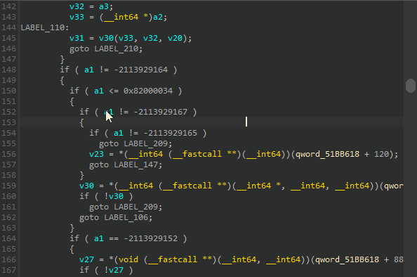

# Hex-Rays Block Highlighter - Highlight blocks in IDA Pseudocode windows

## Overview

Hex-Rays Block Highlighter is an
[IDA Pro](https://www.hex-rays.com/products/ida/) plugin to highlight 
code blocks in the Hex-Rays decompiler output. 

In some cases the decompilation output can be quite hairy with lots of 
nested blocks and it can be hard to follow where one ends and the 
other begins. This plugin will highlight blocks in a _sticky_ way, 
allowing one to navigate within the window while keeping the block 
highlight around.

## Installation

Hex-Rays Block Highlighter is an IDAPython plugin with no external 
dependencies. As such, it should work on all platforms supported by 
IDA.

### Method 1: copying files
Copy the contents of the `plugins` directory into your IDA plugins 
directory and restart IDA.

### Method 2: the `IDAUSR` variable
You could add an entry to your `IDAUSR` environment variables pointing
to the root directory of this project. 

Example:

1. `cd /Users/bob/tmp`
2. `git clone https://github.com/vmallet/ida-hex-highlighter.git`
3. ADD `/Users/bob/tmp/ida-hex-highlighter` to your `IDAUSR` environment 
variable, and restart IDA

## Usage

In a Pseudocode window:
* Double-click on a `do`, `for`, `if`, `switch`, or `while` keyword to 
highlight the corresponding block (or blocks in the `if` and `switch` 
cases).
* Double-click the same keyword to turn the highlighting off
* With the keyboard, navigate to a keyword and press `Shift-H` to toggle
the highlighting on/off
* You can also Right-Click and choose "Highlight Block (toggle)

## Authors

* Vincent Mallet ([vmallet](https://github.com/vmallet))